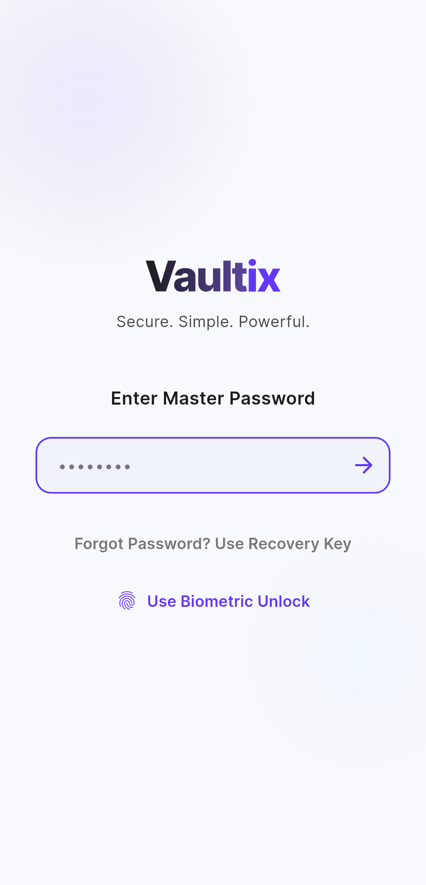
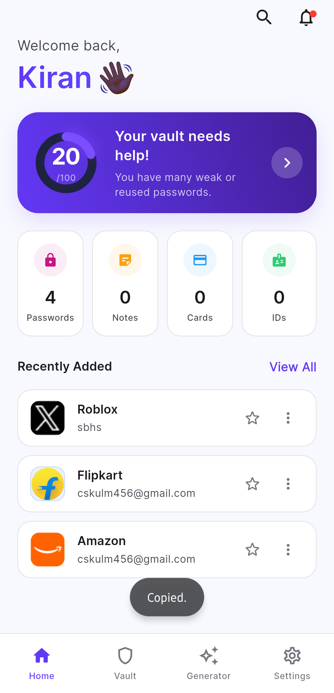
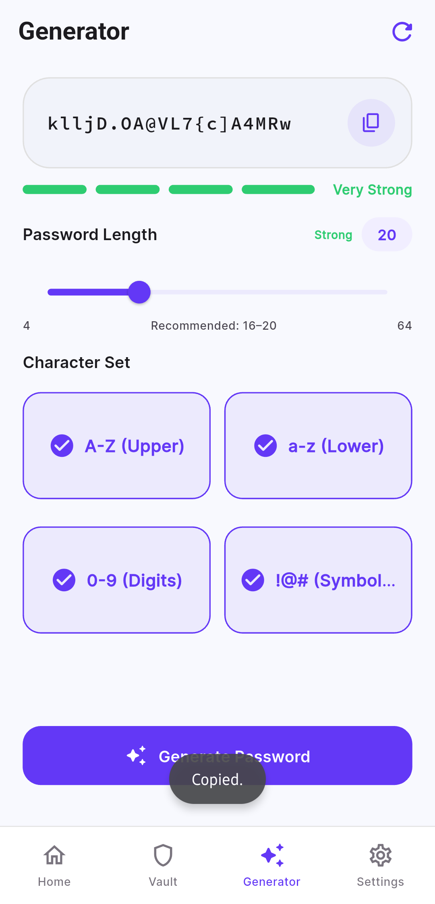
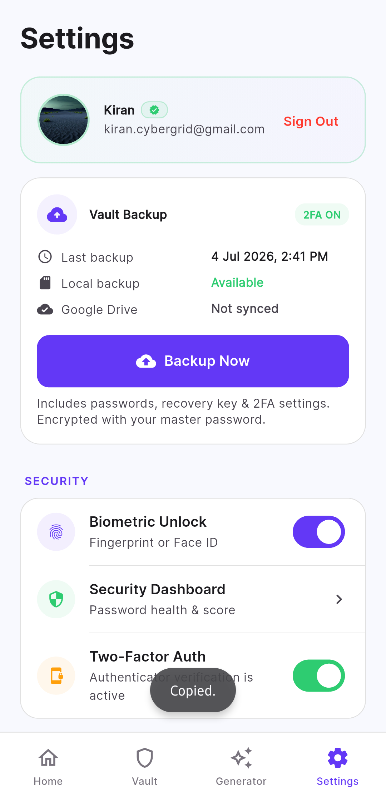
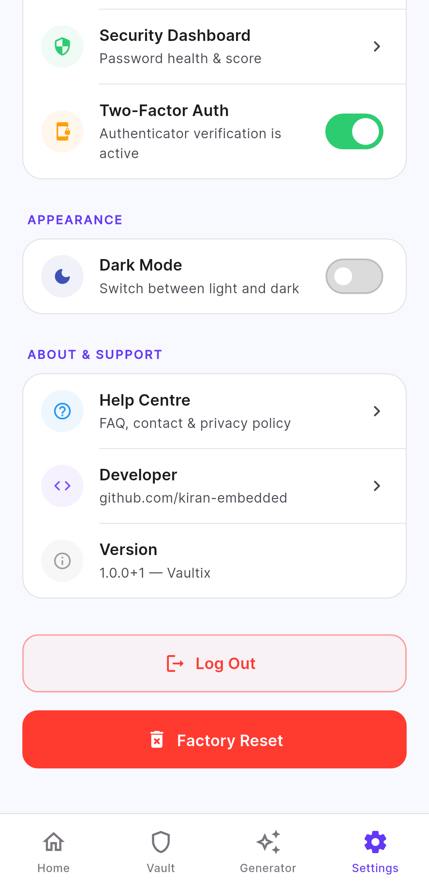

<div align="center">

# 🔐 Vaultix

### Privacy-focused • Offline-first • Secure Password Manager

A modern password manager built with Flutter that keeps your sensitive data encrypted on your device. No mandatory cloud accounts. No central servers. Your data stays under your control.

<p>


</p>

</div>

---

# 💡 Why Vaultix?

Most password managers require cloud accounts or store encrypted data on company servers.

Vaultix takes a different approach.

It is designed around one simple principle:

> **Your passwords should remain under your control.**

Vaultix works completely offline. Your passwords are encrypted on your device before they are stored.

If you choose to create a backup, only the encrypted vault is uploaded to **your own Google Drive**.

Your passwords are never intentionally uploaded as plaintext.

---

# ✨ Features

- 🔒 Offline-first architecture
- 🔑 Master Password protection
- 👆 Fingerprint & Face Unlock
- 🔐 AES-256-GCM encryption
- ☁️ Optional encrypted Google Drive backup
- 📳 Native haptic feedback
- 🛡 Screenshot & screen recording protection
- 🎲 Secure password generator
- 📊 Password Security Score
- ⚠ Weak password detection
- 🔁 Password reuse detection
- 📁 Login, Card, Identity & Secure Note support
- ⭐ Favorites
- 🕒 Recently Added section
- 🌙 Dark & Light themes
- 🎨 Material 3 interface
- ⚡ Smooth animations

---

# 🔐 Security

Vaultix encrypts your data before it is written to storage.

## Encryption Flow

```
Master Password
        │
        ▼
PBKDF2 + Random Salt
        │
        ▼
256-bit Encryption Key
        │
        ▼
AES-256-GCM Encryption
        │
        ▼
Encrypted Local Vault
        │
        ▼
(Optional)
Encrypted Google Drive Backup
```

### Security Details

- PBKDF2 key derivation
- Secure random salt
- AES-256-GCM authenticated encryption
- Optional encrypted cloud backup
- Local-first architecture

---

# 📱 Screenshots

| Login | Dashboard | Password Generator |
|:------:|:---------:|:------------------:|
|  |  |  |

| Settings | Appearance |
|:---------:|:----------:|
|  |  |

---

# 🚀 Tech Stack

- Flutter
- Dart
- Riverpod
- Go Router
- Hive
- Flutter Secure Storage
- Google Sign-In
- Google Drive API
- Local Authentication
- Material 3

---

# 📂 Project Structure

```
lib/
 ├── core/
 ├── features/
 │     ├── home/
 │     ├── vault/
 │     ├── settings/
 │     ├── auth/
 │     └── security/
 ├── shared/
 └── main.dart
```

---

# 📖 License

Vaultix is released under the **GNU General Public License v3.0 (GPLv3).**

This means you are free to:

- Use the project
- Learn from it
- Modify it
- Share it

If you distribute a modified version, GPLv3 requires that your modifications are also released under the same license.

See the **LICENSE** file for more information.

---

# ⭐ Support

If you find this project useful,

please consider giving it a ⭐ on GitHub.

It helps the project reach more developers.

---

<div align="center">

## Built with ❤️ by Kiran

**Privacy First • Security Always**

</div>